

# Shoppa
- This a fake shopping Android app that consumes the [FAKE STORE API](https://fakestoreapi.com/)
- The API has some endpoints that allows one to fetch all items, items categories, register a user and add items to cart.
- Contributions are welcomed😂

## How to Login
- The app uses [Firebase](https://firebase.google.com/) to register and login user. 
- Create an account with a valid email address and verify before login.

## Tech Stack.
- [Kotlin](https://developer.android.com/kotlin) - Kotlin is a programming language that can run on JVM. Google has announced Kotlin as one of its officially supported programming languages in Android Studio; and the Android community is migrating at a pace from Java to Kotlin.
- Jetpack components:
    - [Android KTX](https://developer.android.com/kotlin/ktx.html) - Android KTX is a set of Kotlin extensions that are included with Android Jetpack and other Android libraries. KTX extensions provide concise, idiomatic Kotlin to Jetpack, Android platform, and other APIs.
    - [AndroidX](https://developer.android.com/jetpack/androidx) - Major improvement to the original Android [Support Library](https://developer.android.com/topic/libraries/support-library/index), which is no longer maintained.
    - [ViewModel](https://developer.android.com/topic/libraries/architecture/viewmodel) -The ViewModel class is designed to store and manage UI-related data in a lifecycle conscious way.
    - [Lifecycle](https://developer.android.com/topic/libraries/architecture/lifecycle) - Lifecycle-aware components perform actions in response to a change in the lifecycle status of another component, such as activities and fragments. These components help you produce better-organized, and often lighter-weight code, that is easier to maintain.
    - [LiveData](https://developer.android.com/topic/libraries/architecture/livedata) - LiveData is an observable data holder class. Unlike a regular observable, LiveData is lifecycle-aware, meaning it respects the lifecycle of other app components, such as activities, fragments, or services. This awareness ensures LiveData only updates app component observers that are in an active lifecycle state.
    - [Room database](https://developer.android.com/training/data-storage/room) - The Room persistence library provides an abstraction layer over SQLite to allow fluent database access while harnessing the full power of SQLite.
- [Kotlin Coroutines](https://developer.android.com/kotlin/coroutines) - A concurrency design pattern that you can use on Android to simplify code that executes asynchronously.
- [Retrofit](https://square.github.io/retrofit) -  Retrofit is a REST client for Java/ Kotlin and Android by Square inc under Apache 2.0 license. Its a simple network library that is used for network transactions. By using this library we can seamlessly capture JSON response from web service/web API.
- [GSON](https://github.com/square/gson) - JSON Parser,used to parse requests on the data layer for Entities and understands Kotlin non-nullable and default parameters.
- [Kotlin Flow](https://developer.android.com/kotlin/flow) - In coroutines, a flow is a type that can emit multiple values sequentially, as opposed to suspend functions that return only a single value.
- [Dagger Hilt](https://developer.android.com/training/dependency-injection/hilt-android) - A dependency injection library for Android that reduces the boilerplate of doing manual dependency injection in your project.
- [Logging Interceptor](https://github.com/square/okhttp/blob/master/okhttp-logging-interceptor/README.md) -  logs HTTP request and response data.
- [Glide](https://github.com/bumptech/glide)- Glide is a fast and efficient open source media management and image loading framework for Android that wraps media decoding, memory and disk caching, and resource pooling into a simple and easy to use interface.
- [Timber](https://github.com/JakeWharton/timber)- A logger with a small, extensible API which provides utility on top of Android's normal Log class.
- [MVVM](https://developer.android.com/topic/architecture)- MVVM stands for Model, View, ViewModel. Model: This holds the data of the application. It cannot directly talk to the View. Generally, it's recommended to expose the data to the ViewModel through Observables.
- [PayStack](https://paystack.com/)-  Is an online payment gateway that makes it easy for merchants to accept credit and debit card payments online from users or customers.
- [Daraja](https://developer.safaricom.co.ke/)- Daraja is an Application Programming Interface that creates a bridge for M-Pesa payment integration to web and mobile apps. 

## Demo

### Splash screen
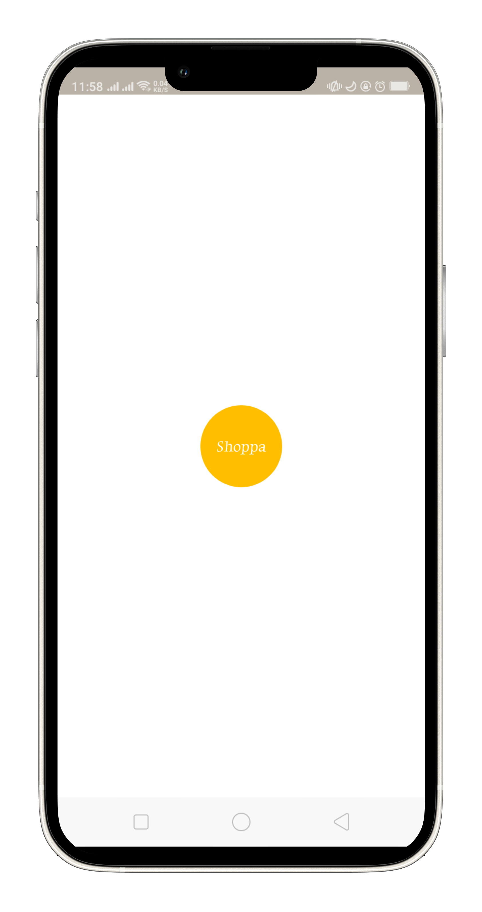 

### Registration
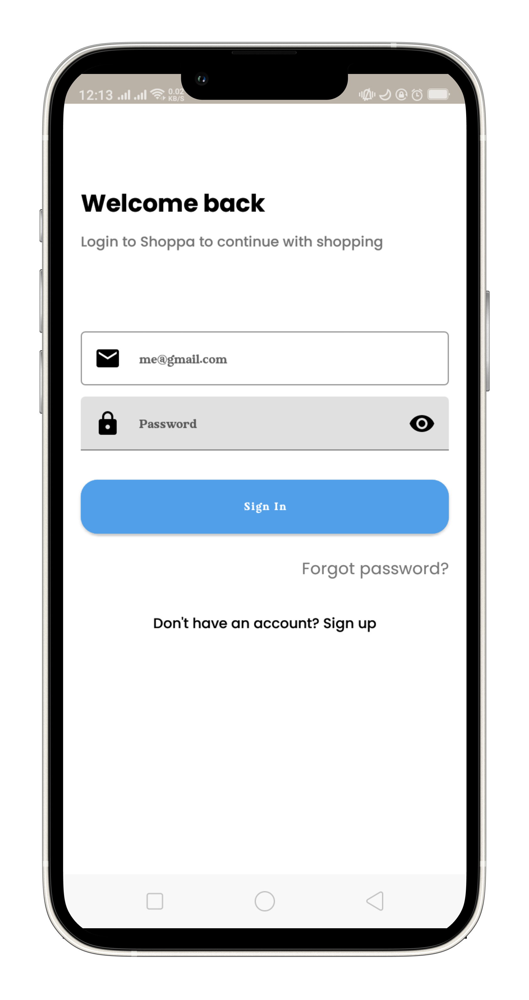 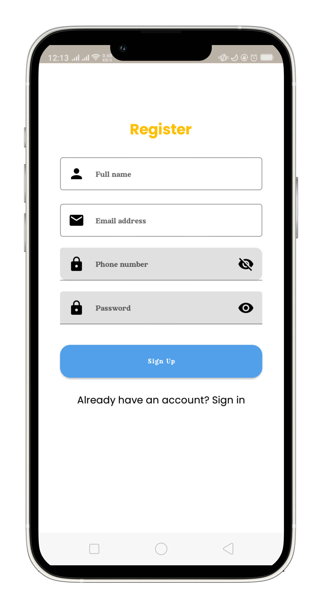 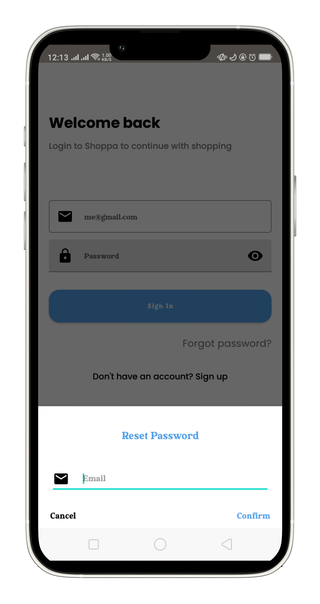

### Home and Details Screens
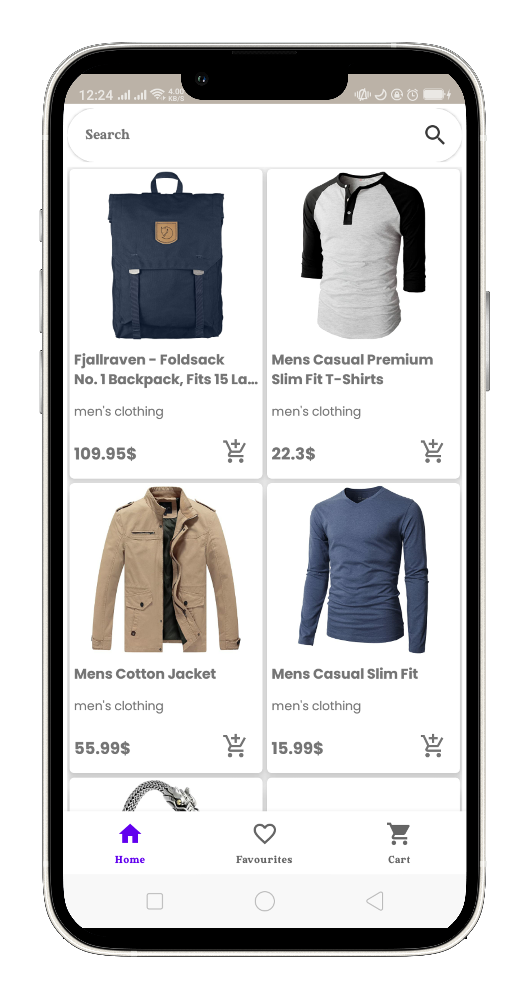 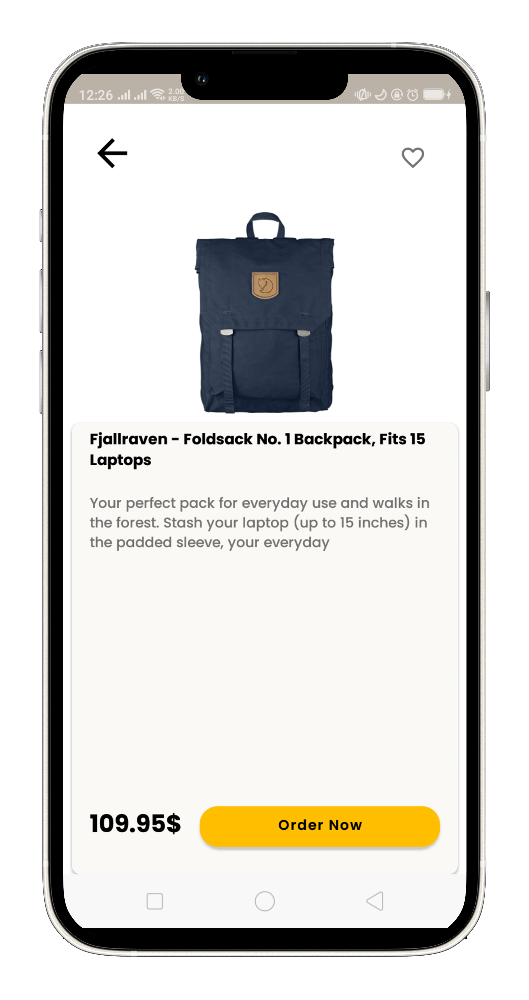

### Favorites and Cart Items Screens
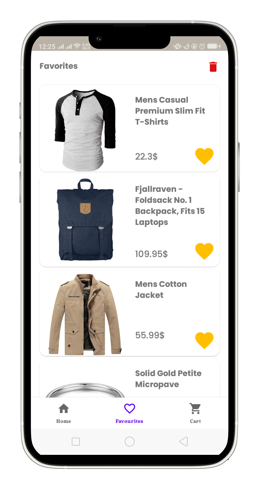 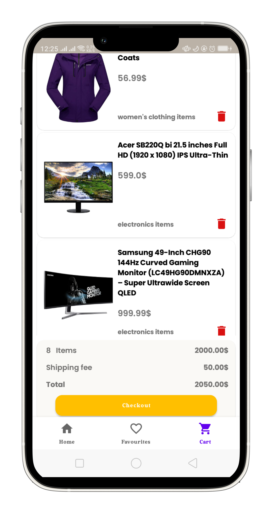

### Search Screens
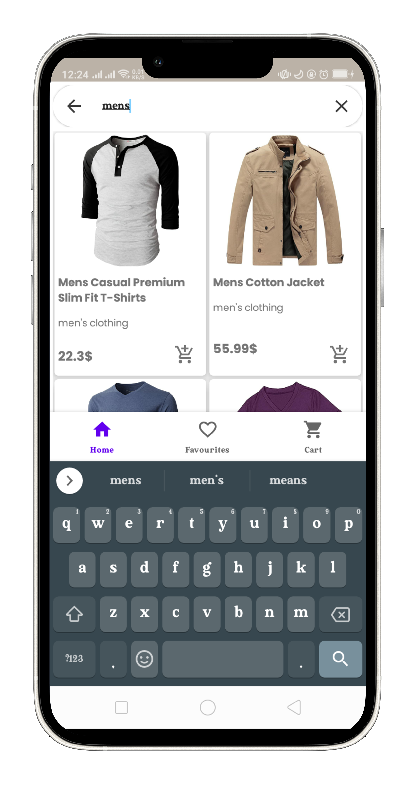 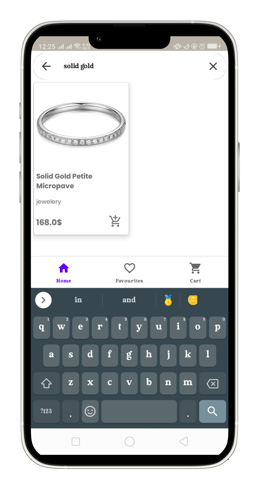 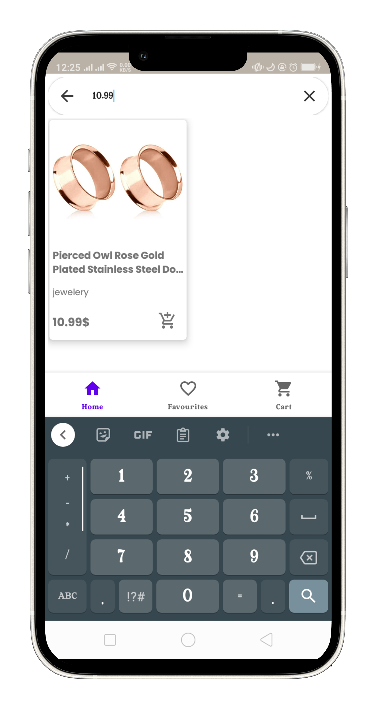

### Payments Screens
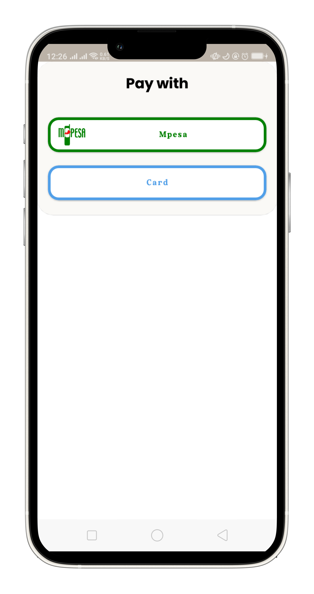 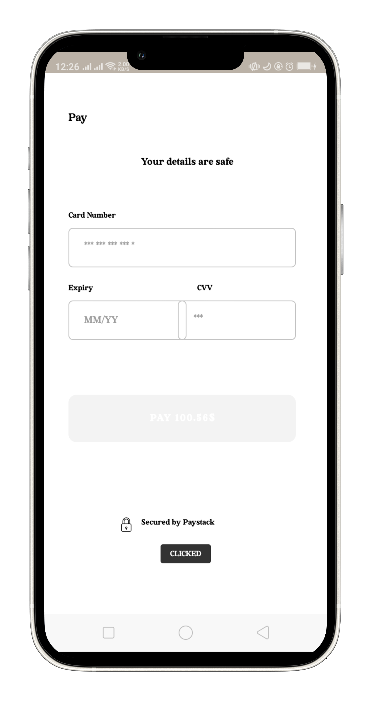 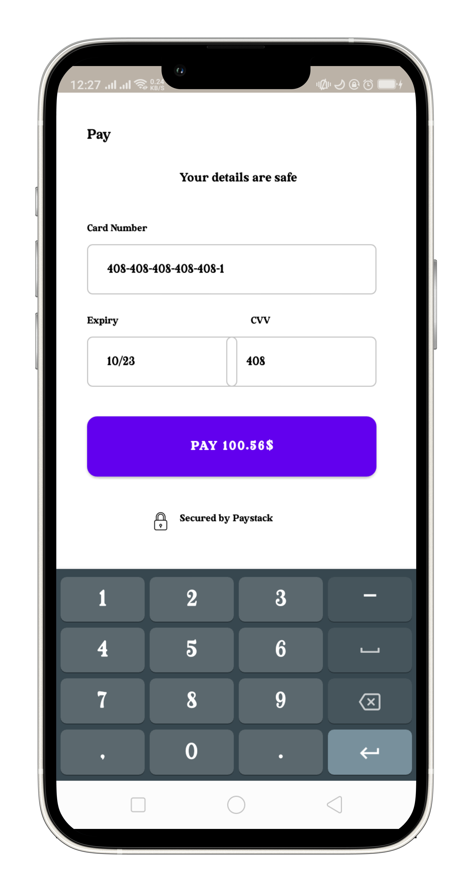 

### Setup Requirements
- Android device or emulator
- Android Studio
- Create your own Firebase project and replace the `google-services.json` with yours.
- Also create an app in the Safaricom Developers portal and use your own `SECRET_KEY` and `CONSUMER_KEY`
- For PayStack follow [here](https://paystack.com/docs/guides/accept_payments_on_your_android_app/)

### Support
- Found this project useful 🧡? Support by clicking the ⭐ button on the upper right of this page ✌️.
- Notice anything else missing? File an issue.
- Feel free to contribute in any way to the project from typos in docs to code review are all welcome. PRs are welcome 🤗

Copyright 2020 Collince Okeyo

   Licensed under the Apache License, Version 2.0 (the "License");
   you may not use this file except in compliance with the License.
   You may obtain a copy of the License at

       http://www.apache.org/licenses/LICENSE-2.0

   Unless required by applicable law or agreed to in writing, software
   distributed under the License is distributed on an "AS IS" BASIS,
   WITHOUT WARRANTIES OR CONDITIONS OF ANY KIND, either express or implied.
   See the License for the specific language governing permissions and
   limitations under the License.
